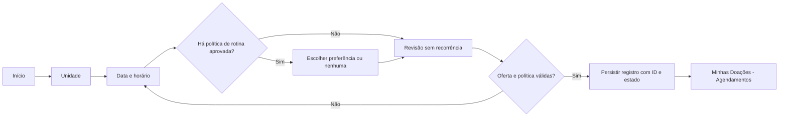

# Doe Sangue — casos de uso

**Sprint 0 — proposta para revisão.** Fluxos abaixo descrevem o comportamento-alvo, não a execução atual. Hoje apenas parte da **navegação visual** existe. “Sistema” inclui o futuro serviço autorizado de agenda/persistência, cuja responsabilidade precisa ser confirmada.

## Atores

- **Doador autenticado:** solicita e consulta os próprios dados; visitante pode ver conteúdo público se a política permitir.
- **Fonte/operador autorizado da unidade:** publica unidade, disponibilidade e, futuramente, confirma coleta; não há interface operacional neste repositório.
- **Supabase Auth e persistência:** infraestrutura proposta, não atores humanos nem integração existente.

## MVP proposto

### CU001 — Acessar conta

- **Ator:** doador; **objetivo:** obter sessão válida para dados privados.
- **Pré-condição:** conta cadastrada conforme política de cadastro ainda pendente.
- **Fluxo principal:** informar credenciais → Auth valida → app recebe sessão → consulta o perfil próprio mínimo → abre área autenticada e apresenta os dados de perfil quando solicitados.
- **Alternativas:** dados inválidos, conta não confirmada ou indisponibilidade → erro sem entrar; sessão expirada → solicitar novo acesso; perfil ausente ou falha após criação da conta Auth → seguir política de criação/recuperação a definir em DP03, sem presumir cadastro completo.
- **Pós-condição:** sessão válida ou nenhum acesso privado concedido. **RN:** RN001, RN002. **RF:** RF001, RF002.

### CU002 — Consultar unidades

- **Ator:** visitante/doador, conforme política de publicação; **objetivo:** identificar unidade e detalhes.
- **Pré-condição:** catálogo com origem autorizada e registro publicado.
- **Fluxo principal:** abrir unidades → carregar lista → escolher unidade → ver endereço e horário de atendimento com fonte/atualização.
- **Alternativas:** catálogo vazio, erro ou dado sem validade → informar estado; não representar unidade fictícia como ativa.
- **Pós-condição:** nenhuma escrita. **RN:** RN002, RN003. **RF:** RF003.

### CU003 — Solicitar agendamento

- **Ator:** doador autenticado; **objetivo:** registrar um agendamento e, se aprovado, uma preferência de rotina.
- **Pré-condições:** CU001 concluído, unidade publicada, serviço de horários disponível e natureza da operação definida em DP02.
- **Fluxo principal:** Início → Agendar → **Escolher unidade** → consultar e **escolher data/horário** dessa unidade → **escolher sem recorrência ou preferência aprovada, se houver etapa de rotina** → **revisar** unidade/data/hora/preferência → **confirmar o envio** → servidor revalida a oferta e **persiste uma solicitação/agendamento com ID e estado** (e vínculo opcional de rotina) → mostrar apenas o estado retornado, sem prometer reserva firme enquanto DP02 estiver aberta → **exibir em Minhas Doações / Agendamentos** via CU004.
- **Alternativas:** sem vagas → estado vazio; falha de rede → erro sem sucesso; vaga perdida/duplicidade → conflito e nova escolha; sessão expirada → voltar a CU001; desistência → nenhuma gravação; política de rotina ainda não aprovada → oferecer somente sem recorrência.
- **Pós-condição:** registro próprio com ID/estado persistidos **ou** nenhum novo registro; nunca coleta confirmada, reserva firme presumida ou estoque alterado. **RN:** RN001, RN004–RN007, RN013. **RF:** RF004–RF008.

### CU004 — Consultar próprios agendamentos

- **Ator:** doador autenticado; **objetivo:** ver próximos e anteriores agendamentos, sem confundi-los com coletas.
- **Pré-condição:** sessão válida.
- **Fluxo principal:** abrir Minhas Doações/Agendamentos → buscar registros próprios → mostrar unidade, data/hora, estado e eventual vínculo de rotina.
- **Alternativas:** nenhum registro → estado vazio; falha → erro; sessão expirada → CU001.
- **Pós-condição:** nenhuma escrita. **RN:** RN001, RN002, RN007. **RF:** RF007, RF008.

## Pós-MVP candidato

### CU005 — Alterar ou cancelar agendamento

- **Ator:** doador autenticado; **objetivo:** atualizar uma solicitação própria.
- **Pré-condições:** agendamento persistido e política da unidade aprovada.
- **Fluxo principal:** abrir detalhe → escolher alteração/cancelamento → servidor verifica estado, prazo e identidade → revalida nova vaga se necessário → grava transição → lista reflete o resultado.
- **Alternativas:** prazo vencido, conflito, estado final ou falha → manter estado anterior e informar; efeito sobre rotina: **DECISÃO PENDENTE**.
- **Pós-condição:** transição auditável ou nenhuma mudança. **RN:** RN002, RN005, RN008. **RF:** RF009.

### CU006 — Consultar histórico de doações efetivas

- **Ator:** doador autenticado; **objetivo:** ver coletas de origem confiável.
- **Pré-condição:** fonte operacional autorizada disponível.
- **Fluxo principal:** consultar registros próprios confirmados → apresentar data, unidade e origem.
- **Alternativas:** sem fonte/registro → não inventar “doação realizada”; falha → erro; dado autodeclarado futuro deve ser identificado separadamente.
- **Pós-condição:** nenhuma coleta confirmada pelo app. **RN:** RN002, RN009. **RF:** RF010.

### CU007 — Consultar campanhas

- **Ator:** visitante/doador; **objetivo:** ler campanhas publicadas.
- **Pré-condição:** conteúdo autorizado e vigente.
- **Fluxo principal:** listar → abrir detalhe com período, origem e unidade vinculada quando houver → opcionalmente iniciar CU003 sem prometer vaga.
- **Alternativas:** vazio, expirada ou erro → não apresentar campanha como vigente.
- **Pós-condição:** nenhuma escrita. **RN:** RN010. **RF:** RF011.

### CU008 — Consultar estoque/necessidade

- **Ator:** visitante/doador; **objetivo:** ler dado publicado com procedência.
- **Pré-condição:** fonte, medida e atualização validadas.
- **Fluxo principal:** selecionar unidade/tipo → exibir medida/nível, origem e data de atualização.
- **Alternativas:** dado ausente/desatualizado → indicar indisponibilidade em vez de inferir nível.
- **Pós-condição:** nenhuma alteração operacional. **RN:** RN011, RN013. **RF:** RF012.

### CU009 — Configurar e receber lembrete

- **Ator:** doador autenticado; **objetivo:** controlar comunicações relativas a agendamento/rotina.
- **Pré-condições:** canal e consentimento definidos; agendamento ou rotina existente.
- **Fluxo principal:** escolher preferência → persistir consentimento → serviço autorizado programa e deduplica aviso → respeita cancelamento.
- **Alternativas:** permissão negada/erro/cancelamento → não enviar ou informar falha.
- **Pós-condição:** preferência registrada; envio só é declarado quando comprovado. **RN:** RN006, RN012, RN013. **RF:** RF013.
