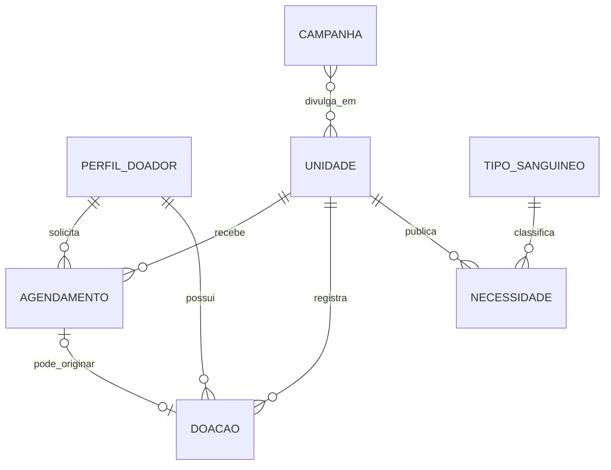

# Modelo de domínio

## Proposto, ainda não implementado

| Entidade | Papel | Relações principais |
| --- | --- | --- |
| PerfilDoador | Dados mínimos associados ao usuário Auth | 1:N agendamentos e doações |
| Unidade | Local de atendimento | 1:N necessidades, agendamentos e doações |
| TipoSanguineo | Vocabulário ABO/Rh | 1:N necessidades |
| Necessidade | Medida publicada por unidade e tipo | N:1 unidade e tipo |
| Agendamento | Reserva solicitada | N:1 perfil e unidade |
| Doacao | Registro operacional confirmado | N:1 perfil e unidade; pode referir agendamento |
| Campanha | Comunicação pública | pode relacionar-se a unidades |

## Pendente

Atributos, obrigatoriedade e cardinalidades finais antes do SQL definitivo.

