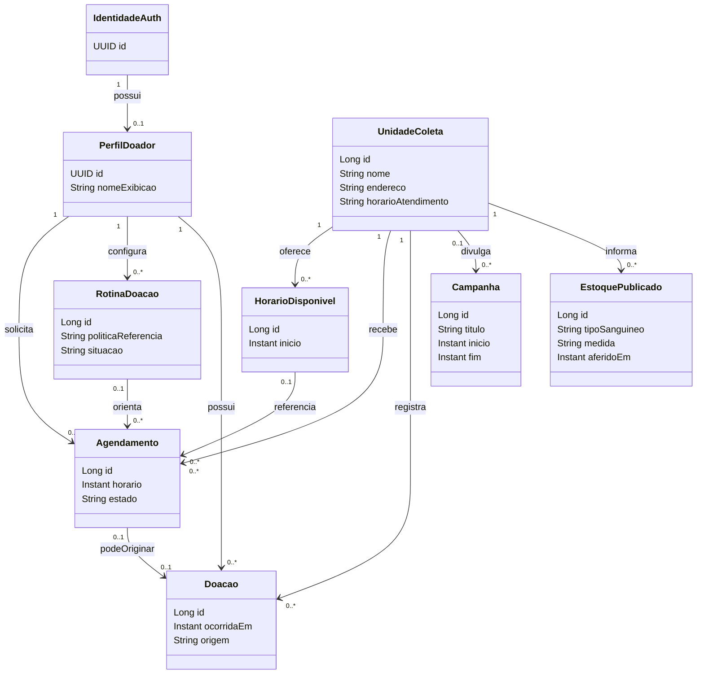
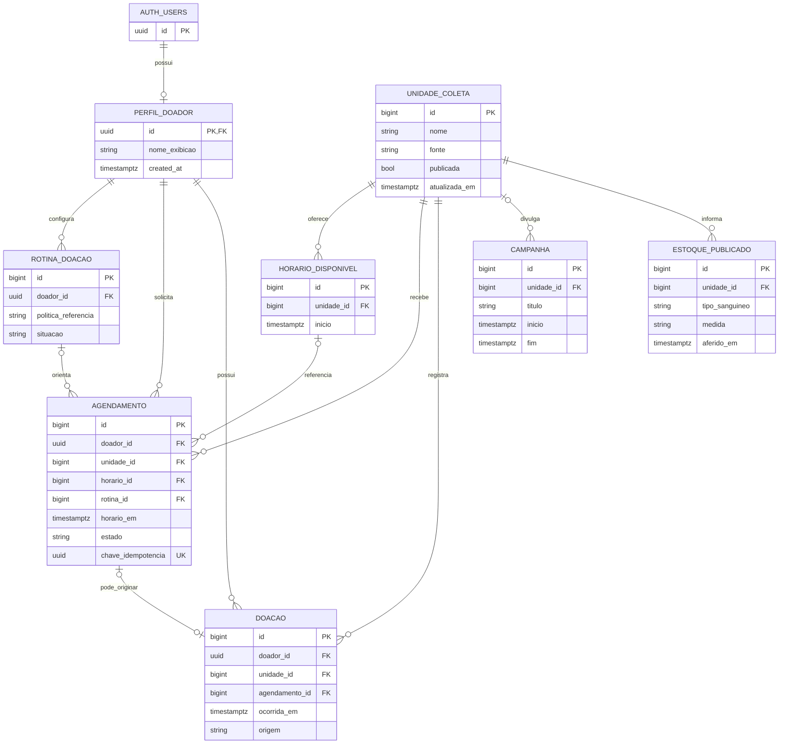

# Doe Sangue — modelo de domínio e banco conceitual

**Sprint 0 — proposta para revisão; nenhuma tabela, migração ou cliente Supabase foi criado.** O modelo deriva de RF001–RF013 e RN001–RN013, não do nome das telas. Apenas `DonationCenter`, `BloodNeed`, `BloodType`, `NeedLevel` e `DonationOverview` já existem em Kotlin; são um recorte de demonstração **não ligado à UI**. Classes abaixo são propostas, não código atual.

## Conceitos e responsabilidades

| Conceito | Papel e atributos conceituais mínimos | Etapa |
| --- | --- | --- |
| **IdentidadeAuth** | Identificador da conta e sessão geridos pelo Supabase Auth; credencial/senha nunca pertence ao modelo do app. | MVP |
| **PerfilDoador** | Perfil próprio vinculado 1:1 à identidade; `id`, nome de exibição e somente dados adicionais justificados. Definir criação/recuperação após cadastro Auth antes de exigir FK no agendamento. Idade, tipo sanguíneo e contato não devem ser presumidos obrigatórios a partir da UI. | MVP, mínimo a validar |
| **UnidadeColeta** | Identidade, nome, endereço, horário de atendimento, contato, publicação, fonte e atualização. Não inclui disponibilidade automaticamente. | MVP |
| **HorarioDisponivel** | Data/hora e unidade provenientes de agenda autorizada; pode ser entidade persistida localmente **somente se** o app controlar vagas. Se a agenda for externa, é uma oferta/DTO, não tabela própria. | MVP, origem pendente |
| **Agendamento** | Registro de solicitação/planejamento do doador em unidade/data/hora; `id`, dono, unidade, instante, estado, criação/alteração, referência opcional à vaga e à rotina. Reserva firme só se DP02 autorizar e o estado indicar; não é coleta. | MVP |
| **RotinaDoacao** | Preferência opcional de recorrência ligada ao doador e potencialmente a vários agendamentos; política/cadência e situação ainda sem valores aprovados. Não agenda automaticamente. | MVP condicionado à regra |
| **Doacao** | Evento de coleta efetiva, com data, unidade, doador e fonte operacional; associação opcional a um agendamento. Não pode ser criada/confirmada pelo doador. | Pós-MVP condicionado à fonte |
| **Campanha** | Conteúdo publicado, período e eventual vínculo com unidade; relação com múltiplas unidades depende do publicador. | Pós-MVP |
| **EstoquePublicado** | Medida/snapshot informado por fonte autorizada, para unidade, tipo sanguíneo e instante de aferição; não é calculado a partir do app. | Pós-MVP |
| **TipoSanguineo** | Vocabulário ABO/Rh (value object/enum); não exige tabela própria sem necessidade de gestão central. `NeedLevel` atual é enum de demonstração, não escala oficial. | Quando necessário |

Não criar entidade adicional `Usuario`/`Doador` só para duplicar `auth.users`/`PerfilDoador`. Lembrete é um evento/comunicação **derivado** de agendamento/rotina; uma tabela de entrega só se justifica quando houver canal, provedor e necessidade de auditoria. Histórico é consulta a `Agendamento` e, futuramente, a `Doacao`, não uma terceira verdade a sincronizar. Informação autodeclarada, se algum dia aprovada, deve ter origem distinta.

## Relacionamentos e cardinalidades propostos

- IdentidadeAuth **1 ↔ 0..1** PerfilDoador; cada perfil tem exatamente uma identidade.
- PerfilDoador **1 → 0..N** Agendamentos e **1 → 0..N** Rotinas.
- UnidadeColeta **1 → 0..N** Agendamentos e, se agenda própria, **1 → 0..N** HorariosDisponiveis.
- RotinaDoacao **0..1 ↔ 0..N** Agendamentos: cada agendamento pode não ter rotina; uma rotina pode agregar vários ao longo do tempo.
- PerfilDoador/UnidadeColeta **1 → 0..N** Doacoes, somente após fonte operacional aprovada; Agendamento **0..1 ↔ 0..1** Doacao, pois uma coleta pode ocorrer sem agendamento.
- UnidadeColeta **1 → 0..N** EstoquesPublicados. Campanha **0..1 unidade → 0..N campanhas** é simplificação provisória; múltiplas unidades exigiriam vínculo N:M após validação.

### UML conceitual (não representa classes já escritas)

`HorarioDisponivel`, `Doacao`, `Campanha` e `EstoquePublicado` são **condicionais**; presença no diagrama não autoriza criar suas tabelas agora. `TipoSanguineo` é valor do estoque, não entidade independente.

**Adequação acadêmica pendente:** a entrega final exige pelo menos seis tabelas relacionadas, cinco FKs e 200 registros sintéticos coerentes. O diagrama contém candidatas suficientes, mas várias são condicionais ou pós-MVP; **não** constitui ainda um esquema aprovado que cumpra o critério. Antes das migrações, escolher seis ou mais tabelas justificadas por funcionalidades e fontes demonstráveis, sem contar `auth.users` como uma das seis para fins de planejamento. Depois definir PK, FKs, constraints e distribuição do seed; ver [banco de dados](09-banco-de-dados.md).

### Recorte relacional de seis tabelas — proposta para revisão

| Tabela do aplicativo | Chave primária proposta | Chaves estrangeiras propostas | Exemplos de integridade a detalhar |
| --- | --- | --- | --- |
| `perfil_doador` | `id uuid PK` | `id → auth.users.id` | Vínculo 1:1 com Auth; dados obrigatórios somente após definir o cadastro mínimo. |
| `unidade_coleta` | `id bigint GENERATED ALWAYS AS IDENTITY PK` | — | Código interno `UNIQUE`, nome `NOT NULL`, `publicada DEFAULT false`, se esses campos forem aprovados. |
| `horario_disponivel` | `id bigint GENERATED ALWAYS AS IDENTITY PK` | `unidade_id → unidade_coleta.id` | Unidade e início `NOT NULL`; unicidade unidade/instante depende da definição de vaga/capacidade. |
| `agendamento` | `id bigint GENERATED ALWAYS AS IDENTITY PK` | `doador_id → perfil_doador.id`; `unidade_id → unidade_coleta.id`; `horario_id → horario_disponivel.id` | Doador e unidade `NOT NULL`; horário por FK somente se a agenda pertencer ao app; chave de idempotência `UNIQUE`. |
| `campanha` | `id bigint GENERATED ALWAYS AS IDENTITY PK` | `unidade_id → unidade_coleta.id` | Título `NOT NULL`; nulidade do vínculo depende da decisão sobre campanhas multiunidade. |
| `estoque_publicado` | `id bigint GENERATED ALWAYS AS IDENTITY PK` | `unidade_id → unidade_coleta.id` | Unidade, medida, fonte e instante de aferição obrigatórios antes de publicação; dados sintéticos não são estoque real. |

São **seis tabelas do aplicativo** e **seis FKs entre elas**, além da FK de `perfil_doador` para `auth.users`. `GENERATED ... AS IDENTITY` é o auto-incremento do PostgreSQL; ele não substitui a declaração de `PRIMARY KEY`. O PDF exige PK adequada em toda tabela, mas **não exige auto-incremento em todas**. A escolha de tipos, nulidade, `UNIQUE`, `DEFAULT` e demais constraints só será definitiva após aprovar as regras e fontes. Em especial, `horario_disponivel`, `campanha` e `estoque_publicado` continuam condicionais; este recorte **não autoriza criar tabelas ou publicar dados de saúde reais**.

## Esboço relacional para Supabase/PostgreSQL

O esboço abaixo detalha as candidatas, inclusive as condicionais fora do recorte de seis tabelas. Os tipos de chave acompanham a proposta acima; nome exato, nullability, índices e status serão fechados antes de SQL. `timestamptz` deve representar instantes; a UI apresenta data/hora no fuso da unidade. `created_at`/`updated_at` são gerados pelo servidor onde aplicáveis.

| Tabela candidata | PK/FK e campos principais | Restrições essenciais |
| --- | --- | --- |
| `perfil_doador` | `id uuid PK/FK → auth.users.id`; `nome_exibicao text`; timestamps. | 1:1; somente o próprio usuário lê/edita campos permitidos. Dados sensíveis adicionais exigem justificativa. |
| `unidade_coleta` | `id bigint IDENTITY PK`; nome, endereço, atendimento, contato, `publicada bool`, fonte, `atualizada_em timestamptz`. | Publicação e edição só por ator autorizado; conteúdo público só se publicado. |
| `horario_disponivel` **condicional** | `id bigint IDENTITY PK`; `unidade_id bigint FK`; `inicio timestamptz`; capacidade/estado se a unidade delegar gestão de vagas. | Unicidade de unidade/instante depende da semântica do slot; não permitir exceder capacidade sob concorrência. Pode não existir se a agenda for externa. |
| `rotina_doacao` **condicional à política aprovada** | `id bigint IDENTITY PK`; `doador_id uuid FK`; `politica_referencia text`; situação; timestamps. | Vínculo privado e política versionada; nenhum intervalo clínico fixado aqui. |
| `agendamento` | `id bigint IDENTITY PK`; `doador_id uuid FK`; `unidade_id bigint FK`; `horario_em timestamptz`; `horario_id bigint FK nullable`; `rotina_id bigint FK nullable`; estado; `chave_idempotencia uuid`; timestamps. | FKs consistentes (slot e rotina devem pertencer à unidade/doador corretos); gravação atômica; idempotência; estado/transições aprovados antes de constraint. |
| `doacao` **pós-MVP** | `id bigint IDENTITY PK`; `doador_id uuid FK`; `unidade_id bigint FK`; `agendamento_id bigint FK nullable UNIQUE`; `ocorrida_em timestamptz`; origem, `registrada_em`. | Somente fonte operacional autorizada insere/confirma; não nasce de confirmação de agendamento. |
| `campanha` **pós-MVP** | `id bigint IDENTITY PK`; `unidade_id bigint FK nullable`; título, conteúdo, período, fonte, publicação. | Publicador autorizado; período coerente; vínculo multiunidade ainda pendente. |
| `estoque_publicado` **pós-MVP** | `id bigint IDENTITY PK`; `unidade_id bigint FK`; `tipo_sanguineo text`; medida, unidade de medida, fonte, `aferido_em`, `publicado_em`. | Fonte/medida/instante obrigatórios; somente operação autorizada escreve; sem atualização por agendamento. |

Se `horario_disponivel` for externo, `horario_id` deixa de existir e o agendamento guarda referência externa e snapshot do horário; isso é uma **DECISÃO PENDENTE**, não motivo para criar as duas formas já. A chave de idempotência deve ser única no escopo do doador/operação. `status` e periodicidade só se tornam enum/`CHECK` depois de aprovar o vocabulário; `horario_em` não deve divergir de slot. A integridade de capacidade pode exigir transação/RPC server-side, não apenas `SELECT` no cliente.

### ERD conceitual (tabelas condicionais incluídas para mostrar separações)

## Segurança, dados pessoais e decisões

**Privados:** perfil, identidade Auth, agendamentos, rotinas, doações e preferências/lembretes futuros. **Publicáveis sob controle editorial:** unidades, campanhas e snapshots de estoque. Não colocar nome/contato do doador nas tabelas públicas. RLS candidata: `auth.uid() = doador_id` para leitura própria e somente escritas próprias expressamente autorizadas; `perfil_doador.id = auth.uid()` para campos editáveis do perfil; escrita de unidade/estoque/campanha/doação vedada ao app do doador; leitura pública somente de registros publicados. A regra de posse não autoriza o doador a definir ou alterar `estado`, vaga, unidade, horário ou vínculo de rotina arbitrariamente: criação, revalidação de capacidade e transições devem ocorrer em operação server-side com permissões e campos delimitados. RLS não substitui validação de disponibilidade, integridade entre FKs nem controle de concorrência. Papel operacional e uso de `service_role` são assunto de infraestrutura segura, jamais de APK. Políticas exatas de SELECT/INSERT/UPDATE/DELETE por tabela e papel, consentimento, retenção e testes com dois usuários/anon serão definidos antes de migrações.

**DECISÕES PENDENTES:** fonte e controle de vagas; campos pessoais estritamente necessários; status e transições; semântica da rotina; autoria de doação confirmada; campanhas multiunidade; medida/frescor de estoque; política RLS detalhada. Ver [roadmap](07-desenvolvimento_roadmap_MVP.md).
