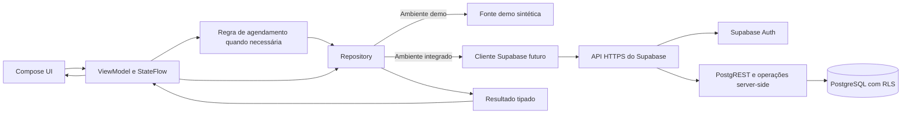

# Doe Sangue — arquitetura

**Atualização de 29/09/2026:** a triagem demonstrativa foi substituída por listas
informativas. As rotas tipadas `Restrictions` e `RestrictionDetail(category)`
conservam a categoria e a navegação. Conteúdo editorial imutável está em
`presentation/restrictions`, sem Compose ou regras clínicas. Sem operações
assíncronas, este recorte não precisa de Repository ou ViewModel.
Ver [estado e limites da implementação](13-triagem-medicamentos.md).

**Base arquitetural proposta na Sprint 0; navegação atualizada em 23/09/2026.** Navigation Compose foi implementado; a integração funcional das camadas continua planejada. O objetivo é tornar o fluxo de [CU003](04-casos-de-uso.md#cu003--solicitar-agendamento) implementável e testável. Ver [domínio](05-modelo-de-dominio.md) e [roadmap](07-desenvolvimento_roadmap_MVP.md).

## Fotografia do código atual

- **Configurado/funcionando:** Kotlin, Jetpack Compose, Material 3, tema Poppins, Activity edge-to-edge, componentes e 34 rotas visuais. `DoeSangueApp` cria um `rememberNavController`; `AppNavHost` conecta os grafos Auth/Main/Scheduling. Navigation Compose 2.9.8 e Kotlin Serialization estão no Gradle. O roteador antigo foi substituído.
- **Recorte técnico não conectado à UI:** `DonationOverviewRepository`, `DemoDonationOverviewDataSource`, `GetDonationOverviewUseCase`, `HomeUiState`, `HomeViewModel` com `StateFlow` e `AppContainer`. A Activity chama diretamente `DoeSangueApp`; nenhum ViewModel/repository alimenta Home, unidades ou estoque.
- **Ausente:** dependência/cliente Supabase, Auth, migrações, DTOs remotos, persistência, disponibilidade, estado de seleção entre etapas, buscas e tratamento real de erro/loading. O Manifest não declara permissão de rede. Nenhuma tela edita dados: `VisualField` é texto em uma caixa, controles selecionáveis usam valores fixos, e ações de backend são no-op ou navegação.

## Fluxo-alvo mínimo



As setas de retorno representam a resposta da mesma operação, não um segundo canal de dados. Na implementação, a UI envia intenção/seleção ao ViewModel; ele expõe estado imutável, chama repository e usa caso de uso **apenas** quando houver regra real (por exemplo, revalidação/consistência da solicitação). O repository coordena fonte de agenda e persistência; conversão DTO ↔ domínio fica na fronteira `data`, sem espalhar JSON/PostgREST nas telas. Corrotinas realizam I/O fora da UI e podem ser canceladas pelo ciclo de vida.

O uso do Supabase foi sugerido pelo professor. A API HTTPS é a camada intermediária entre Android e PostgreSQL; o app não contém credencial do banco nem abre conexão SQL direta. RLS e operações server-side continuam necessárias para autorização e regras atômicas. O fluxo de autenticação aprovado oferece e-mail/senha e Google; Google requer configuração do provedor e retorno por deep link no Android. A política de senha de [RNF008](02-requisitos.md) vale somente para e-mail/senha e deve ser aplicada no Supabase Auth, além de explicada na UI. Nada disso está implementado.

Não criar um caso de uso para cada clique nem interfaces genéricas vazias. Começar pelos contratos necessários a CU002–CU004. O `GetDonationOverviewUseCase` já existente pode ser mantido como exemplo, mas sua utilidade deve ser reavaliada quando uma feature o consumir.

## Organização sugerida de pacotes

Preservar as camadas atuais, sem reorganização massiva. Agrupar **UI e estado por feature**, mantendo modelos/regras compartilhados apenas quando realmente compartilhados:

```text
ui/{onboarding,auth,home,scheduling,donations,centers,campaigns,profile}
ui/{components,navigation,theme}
presentation/{auth,scheduling,donations,centers,home}
domain/{model,repository,usecase}          # usecase só com regra concreta
data/{demo,source,repository,supabase}      # supabase apenas na integração
di/                                        # composição explícita inicialmente
```

Uma feature pequena pode ter um ViewModel e um repository sem use case intermediário. Evitar duplicar modelos de UI, domínio e banco se não houver transformação real.

## Navegação e estado

- **Implementado:** rotas tipadas em `AppRoute`, grupos em `AppGraph`, grafos por fluxo e callbacks nas telas. Splash e Auth são retirados da pilha ao concluir suas transições. Trocar de aba remove o percurso anterior de Main. A seta das raízes usa `navigateBackOrHome`: retorna à tela anterior se existir; caso contrário, abre Home sem esvaziar a pilha. O botão Voltar do Android mantém o comportamento padrão do NavHost.
- **Pendente:** histórico independente por aba, argumentos como `agendamentoId`, deep links e estado funcional do rascunho. `HomeScheduled` continua estática. Restaurar uma rota não equivale a persistir seleções ou dados. A escolha de Navigation Compose está registrada em [ADR-003](decisoes/ADR-003-navegacao-compose.md).
- O rascunho de agendamento deve sobreviver à troca entre etapas/recriação de Activity sem gravar um agendamento prematuramente; o estado persistido só nasce após confirmação do servidor. Tela de sucesso recebe ID/estado persistidos e pode consultar CU004; não chama a solicitação de reserva confirmada sem a decisão DP02. Seleção visual não é dado persistido.
- Para consultas: `Loading`, `Content`, `Empty`, `Error`. Para comando: `Idle`, `Submitting`, `Success(id)`, `Error`. Erro preserva a escolha do usuário e permite repetir com idempotência; não avançar para sucesso apenas porque o botão foi tocado.

## Persistência, segurança e fontes

- **Planejado:** Supabase Auth para sessão, PostgreSQL/RLS para perfil/agendamentos, fonte autorizada para unidades/vagas. A origem da disponibilidade e o direito de reservar são **DECISÕES PENDENTES**. Se capacidade estiver no banco, registrar/confirmar via operação atômica server-side que valide identidade, campos permitidos, vaga e transição; consulta seguida de insert no cliente não evita conflito. RLS de posse, isoladamente, não controla estado ou capacidade.
- URL e chave **publicável** do projeto podem configurar o cliente por ambiente; não embutir `service_role`, senha de banco ou token de usuário no código/versionamento. Segredos de servidor ficam fora do Android. Não executar migração remota nesta Sprint 0.
- Dados demo continuam em `data/demo` e devem ser identificados como sintéticos. Injeção explícita da fonte por ambiente permite testes; não misturar fallback demo silencioso em produção. Conteúdo público futuro requer procedência e atualização. `Doacao`, estoque e campanhas somente com publicador autorizado; RLS e matriz de papéis serão testadas antes de exposição.
- Erros de rede, autenticação, conflito, indisponibilidade e dados vazios devem ser distinguíveis na camada de dados/domínio, convertidos em mensagens de UI sem vazar detalhes técnicos ou dados pessoais em logs.

## Testabilidade e critérios de integração

**Implementado:** testes instrumentados de navegação por cliques, inspeção do destino/pilha e restauração do estado salvo do Compose em `AppNavigationTest`. **Planejado:** testes de ViewModel/repository, rascunho funcional, integração Supabase/RLS com usuários distintos e concorrência por vaga. Os testes atuais não cobrem esses comportamentos de negócio. Ver [validação](12-validacao.md).

**Limite clínico:** configurações de elegibilidade/frequência, se autorizadas, devem vir de política versionada e validada, não de literais das telas. **Regra dependente de fonte oficial / pendente de validação.** O aplicativo não faz triagem.
