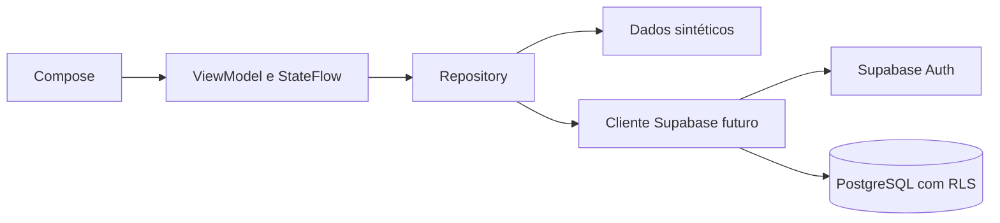

# Arquitetura

## Confirmado

Android nativo, Compose, MVVM com Repository e Supabase/PostgreSQL/Auth/PostgREST.

## Proposto

Pacotes adotados: `ui`, `presentation`, `domain`, `data/source`, `data/demo`, `data/repository` e `di`. A UI observa estado imutável; ViewModels coordenam casos de uso; repositories escondem a origem dos dados. O pacote futuro `data/supabase` será criado somente quando a integração começar.

## Implementado

Além da Activity e do tema, existe um recorte vertical com modelos de unidade/necessidade, contrato de repository, caso de uso, fonte sintética, implementação de repository, `HomeUiState`, `HomeViewModel` com StateFlow/corrotinas e `AppContainer` para composição manual.

A camada `ui` está organizada por responsabilidade em `components`, `navigation`, `screens` e `theme`; as telas ficam separadas por contexto (`auth`, `onboarding`, `home`, `scheduling`, `donations`, `campaigns`, `centers` e `profile`). O roteador Compose mantém uma pilha local e não depende de backend. Nesta etapa visual, a UI não consome ViewModels nem repositories, evitando simular funcionalidades que ainda não foram solicitadas.

## Segurança pendente

Definir RLS e testá-la com usuários distintos e cliente anônimo; nenhuma chave administrativa irá para o Android.
