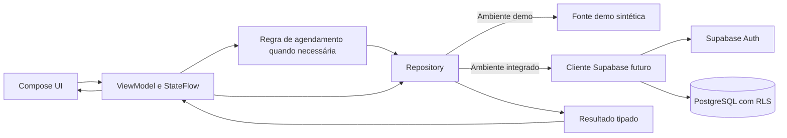

# Doe Sangue — arquitetura

**Sprint 0 — arquitetura proposta, não refatoração executada.** Objetivo: tornar o fluxo de [CU003](04-casos-de-uso.md#cu003--solicitar-agendamento) implementável e testável com poucos conceitos. A separação de domínio/banco está em [05](05-modelo-de-dominio.md), a sequência de entrega em [07](07-desenvolvimento_roadmap_MVP.md).

## Fotografia do código atual

- **Configurado/funcionando:** Kotlin, Jetpack Compose, Material 3, tema Poppins, Activity edge-to-edge, `Scaffold`, componentes e 34 rotas visuais. `AppNavigator` mantém lista mutável de rotas em memória; `DoeSangueApp` decide a tela com `when` e callbacks. Não há Navigation Compose no catálogo/Gradle.
- **Recorte técnico não conectado à UI:** `DonationOverviewRepository`, `DemoDonationOverviewDataSource`, `GetDonationOverviewUseCase`, `HomeUiState`, `HomeViewModel` com `StateFlow` e `AppContainer`. A Activity chama diretamente `DoeSangueApp`; nenhum ViewModel/repository alimenta Home, unidades ou estoque.
- **Ausente:** dependência/cliente Supabase, Auth, migrações, DTOs remotos, persistência, disponibilidade, estado de seleção entre etapas, buscas e tratamento real de erro/loading. O Manifest não declara permissão de rede. Nenhuma tela edita dados: `VisualField` é texto em uma caixa, controles selecionáveis usam valores fixos, e ações de backend são no-op ou navegação.

## Fluxo-alvo mínimo



As setas de retorno representam a resposta da mesma operação, não um segundo canal de dados. Na implementação, a UI envia intenção/seleção ao ViewModel; ele expõe estado imutável, chama repository e usa caso de uso **apenas** quando houver regra real (por exemplo, revalidação/consistência da solicitação). O repository coordena fonte de agenda e persistência; conversão DTO ↔ domínio fica na fronteira `data`, sem espalhar JSON/PostgREST nas telas. Corrotinas realizam I/O fora da UI e podem ser canceladas pelo ciclo de vida.

Não criar um caso de uso para cada clique nem interfaces genéricas vazias. Começar pelos contratos necessários a CU002–CU004. O `GetDonationOverviewUseCase` já existente pode ser mantido como exemplo, mas sua utilidade deve ser reavaliada quando uma feature o consumir.

## Organização sugerida de pacotes

Preservar as camadas atuais, sem reorganização massiva. Agrupar **UI e estado por feature**, mantendo modelos/regras compartilhados apenas quando realmente compartilhados:

```text
ui/{onboarding,auth,home,scheduling,donations,centers,campaigns,profile}
ui/{components,navigation,theme}
presentation/{auth,scheduling,donations,centers,home}
domain/{model,repository,usecase}          # usecase só com regra concreta
data/{demo,source,repository,supabase}      # supabase apenas na integração
di/                                        # composição explícita inicialmente
```

Uma feature pequena pode ter um ViewModel e um repository sem use case intermediário. Evitar duplicar modelos de UI, domínio e banco se não houver transformação real.

## Navegação e estado

- **Atual:** roteador próprio em memória; `replaceRoot` limpa pilha ao trocar aba. A confirmação navega para `HomeScheduled` estática, não busca registro. A correção `navigationBarsPadding()` na barra inferior está **modificada localmente, ainda não commitada** e não integra esta Sprint 0.
- **Proposta:** avaliar Navigation Compose antes da implementação funcional para rotas tipadas, argumentos de `agendamentoId`, restauração e back stack. **DECISÃO PENDENTE:** manter o roteador simples se testes cobrirem restauração/deep links necessários, ou adotar a dependência oficial. Não afirmar que Navigation Compose já está presente.
- O rascunho de agendamento deve sobreviver à troca entre etapas/recriação de Activity sem gravar um agendamento prematuramente; o estado persistido só nasce após confirmação do servidor. Tela de sucesso recebe ID/estado persistidos e pode consultar CU004; não chama a solicitação de reserva confirmada sem a decisão DP02. Seleção visual não é dado persistido.
- Para consultas: `Loading`, `Content`, `Empty`, `Error`. Para comando: `Idle`, `Submitting`, `Success(id)`, `Error`. Erro preserva a escolha do usuário e permite repetir com idempotência; não avançar para sucesso apenas porque o botão foi tocado.

## Persistência, segurança e fontes

- **Planejado:** Supabase Auth para sessão, PostgreSQL/RLS para perfil/agendamentos, fonte autorizada para unidades/vagas. A origem da disponibilidade e o direito de reservar são **DECISÕES PENDENTES**. Se capacidade estiver no banco, registrar/confirmar via operação atômica server-side que valide identidade, campos permitidos, vaga e transição; consulta seguida de insert no cliente não evita conflito. RLS de posse, isoladamente, não controla estado ou capacidade.
- URL e chave **publicável** do projeto podem configurar o cliente por ambiente; não embutir `service_role`, senha de banco ou token de usuário no código/versionamento. Segredos de servidor ficam fora do Android. Não executar migração remota nesta Sprint 0.
- Dados demo continuam em `data/demo` e devem ser identificados como sintéticos. Injeção explícita da fonte por ambiente permite testes; não misturar fallback demo silencioso em produção. Conteúdo público futuro requer procedência e atualização. `Doacao`, estoque e campanhas somente com publicador autorizado; RLS e matriz de papéis serão testadas antes de exposição.
- Erros de rede, autenticação, conflito, indisponibilidade e dados vazios devem ser distinguíveis na camada de dados/domínio, convertidos em mensagens de UI sem vazar detalhes técnicos ou dados pessoais em logs.

## Testabilidade e critérios de integração

Testes unitários de ViewModel/repository com fonte falsa cobrem loading/erro/sucesso e revalidação; testes de integração em ambiente Supabase de desenvolvimento cobrem dois usuários, cliente anônimo, leitura pública, escrita própria e negação de escrita operacional; teste de concorrência cobre duas tentativas para a mesma vaga. Testes de navegação verificam retorno e restauração do rascunho. A suíte atual não contém esses testes.

**Limite clínico:** configurações de elegibilidade/frequência, se autorizadas, devem vir de política versionada e validada, não de literais das telas. **Regra dependente de fonte oficial / pendente de validação.** O aplicativo não faz triagem.
